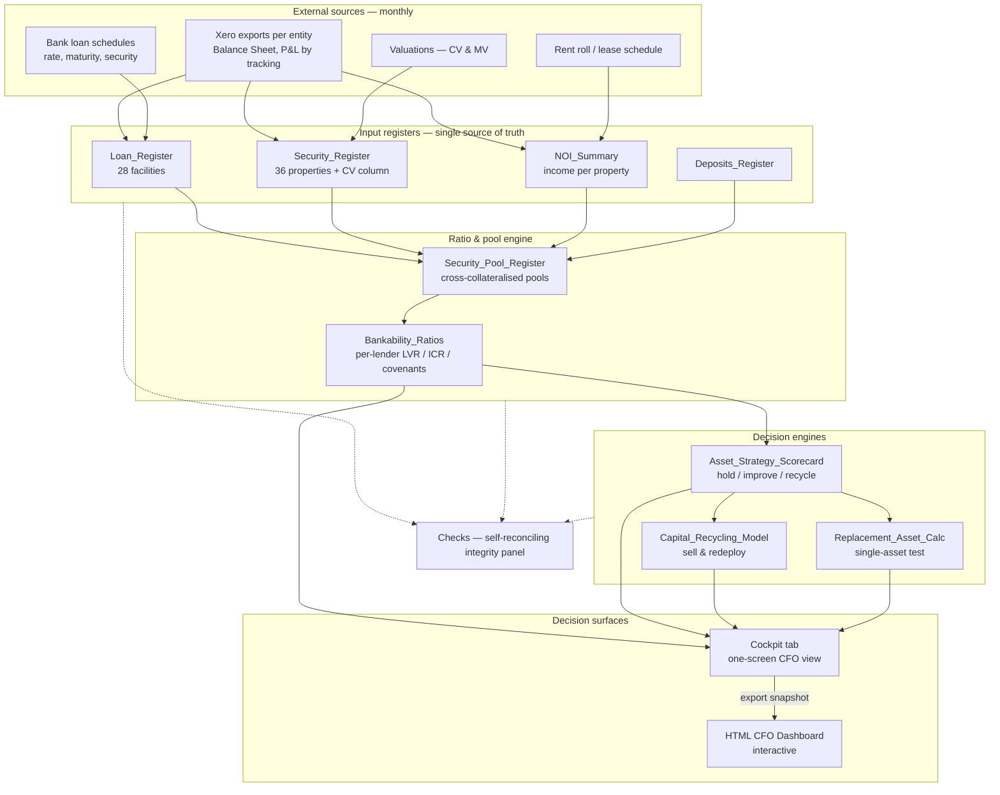

# Ramwall Group — CFO Dashboard & Finance Model: Architecture & Specification

_A handoff document describing the full system: data model, engines, formulas, and the decision surfaces built on top. Written so another AI or analyst can understand and extend it._

---

## 1. Purpose

Ramwall Group is a New Zealand property investment and development group of ~10 entities. This system gives the CFO a single, reconciled view of the portfolio and answers four questions on demand:

1. **Where do we stand?** — portfolio value, debt, LVR, NOI, headroom.
2. **Are we inside covenant?** — per lender, with pass/breach.
3. **What should we do with each asset?** — hold, improve, or recycle.
4. **If we sell, what actually happens?** — how much debt must be repaid to release the security, how much cash is truly freed, and what a replacement must yield.

## 2. Two artefacts

The system is deliberately split into a **backbone** and a **surface**:

| Artefact | Role | Nature |
|---|---|---|
| `Master_Finance_Schedule.xlsx` | Analytical backbone — reconciled system of record and calculation engine | 21 tabs, ~2,160 formulas, self-reconciling, zero-error on recalculation |
| `Ramwall_CFO_Dashboard.html` | Visual decision surface for the CFO/CEO | Self-contained (no external calls), interactive, data-snapshot embedded |

**Design principle:** the workbook is the source of truth and reconciles to itself; the HTML dashboard is a point-in-time visual read of it. The dashboard never recalculates the accounts — it displays a snapshot exported from the workbook.

## 3. Architecture (data flow)



## 4. Update workflow ("update whenever")

Monthly, point-in-time and auditable:

1. Export standard reports from Xero per entity (Balance Sheet for loan balances; P&L by tracking category for rent per property).
2. Paste into the input registers (`Loan_Register`, `Security_Register`, `NOI_Summary`) — layouts are designed to receive the exports.
3. Update the hand-kept loan detail (rate, maturity, which facility secures which property — this does not live in Xero cleanly).
4. Enter new council valuations (CV) in `Security_Register` column L.
5. Recalculate — the whole model refreshes and `Checks` confirms it still ties out.
6. To refresh the HTML dashboard, replace the embedded data block (or regenerate it from the updated workbook).

The **live Xero connector operates one entity at a time** and does not consolidate; for a multi-entity group the **export workflow is the backbone**, with the connector used only for spot-checks.

## 5. Excel workbook — tab inventory (21 tabs)

**Navigation:** `01_Present_State`, `02_Future_Planning`

**Decision surface:** `Cockpit` (one-screen CFO view; the tab you land on)

**Dashboards / strategy:** `Dashboard`, `Institutional_CEO_Dashboard`, `$1B_Equity_Roadmap`

**Input registers (source of truth):**
- `Loan_Register` — 28 facilities. Columns: Borrower/Entity, Lender, Security Pool, Facility Ref, Facility Type, Current Amount Owing, Current/Weighted Rate, Annual Interest, Rate Expiry/Status, Loan Term Expiry, Repayment Type, Notes.
- `Security_Register` — 36 properties. Columns: Property, Entity, Security Status, Former Lender, Lender/Bank, Security Type, Market Value (MV), Bank Value (BV), Pool Contribution %, Valuation Date, Notes, **Council Valuation (CV)** [added].
- `NOI_Summary` — income per property. Columns: Entity, Property, Mapping Status, Lender View, Occupancy Note, Bank/Market Value, Security Pool, Gross Income, Included Opex, Normalized NOI, Excluded Non-NOI Items, Pool LVR, % of Pool NOI, Debt Bank Exposure.
- `Deposits_Register`, `NOI_Budget_FY27`.

**Ratio & pool engine:**
- `Security_Pool_Register` — the cross-collateralisation model. Per pool: Target Release LVR, Stress Rate, Current Pool Value, Current Pool Debt, Current Pool NOI, Pool LVR, Debt Yield, Pool ICR, No. of Assets.
- `Bankability_Ratios` — per-lender debt/value/NOI/LVR/ICR (current and @ stress) and the covenant compliance block.

**Decision engines:**
- `Asset_Strategy_Scorecard` — 27 assets. Per asset: Value, NOI, NOI Yield, Pool LVR, Pool ICR, Debt Repayment Required if sold, Cash Released, NOI Lost, Replacement Yield Required, Decision, Rationale.
- `Capital_Recycling_Model` — sell-and-redeploy engine.
- `Replacement_Asset_Calc` — single-property sale/redeploy test.
- `Asset_Ranking`, `Funding_Acquisitions`.

**Integrity & ops:** `Checks` (self-reconciling — debt, value and NOI tie across every tab), `Update_Log`, `Missing_Info`.

## 6. Core data model

Two masters drive everything:

- **Property master** (`Security_Register`): one row per property → owning entity, lender/pool, **MV**, **BV** (bank value), **CV** (council value), valuation date.
- **Loan master** (`Loan_Register`): one row per facility → lender, pool, balance, rate, fixed/floating, rate-expiry, term-expiry, repayment type.

Everything else calculates off these two plus `NOI_Summary` (income).

Three valuation bases are tracked deliberately and are **not** interchangeable:
- **MV** — market value (what you'd sell for; default sale price).
- **BV** — bank value (what the lender holds it at; the covenant basis).
- **CV** — council/rating valuation.

## 7. Key metrics & formulas

Lenders: **ASB** and **BNZ** (senior), **GH Invest** (second-tier development, 8.00% p.a., interest capitalised).

**Investment vs development split** (development = anything owned by *Ramwall Development Limited*, i.e. 124 Edinburgh St + Bremner Rd, GH-secured):

- Investment Value (MV) = ΣMV − ΣMV(Ramwall Development Ltd) = **$66.43m**
- Senior Debt (ASB+BNZ) = **$37.59m**
- Investment BV = total BV − GH BV = **$64.22m**
- **Investment LVR = Senior Debt ÷ Investment BV = 58.5%** (on bank value)
- **Senior capacity to 65% LVR = 0.65 × Investment BV − Senior Debt = $4.15m**
- Annual NOI = **$2.93m**; investment debt yield = NOI ÷ Senior Debt = **7.8%**

**Development (shown separately so it does not distort group LVR):**
- 124 Edinburgh St — **held for sale** = $19.43m MV
- Other development (Oiroa Grove / Bremner) = $2.48m MV
- GH Invest drawn = $8.14m
- **Development LVR = GH Debt ÷ GH BV = 42.0%** (vs 60% covenant)
- GH capacity to 60% LVR = 0.60 × GH BV − GH Debt = $3.48m

Why the split matters: the blended group figure read 54.7% LVR / $8.6m headroom, which flattered the investment book. Stripping out GH/development shows investment truly at **58.5% and only $4.15m from its 65% ceiling**.

**Per-lender ICR (under 7% stress):** ASB **1.33x**, BNZ **0.38x** (see caveat below). GH Invest is **excluded** from ICR because its interest capitalises and it carries no serviceable income — blending it in understates every other lender's coverage.

_BNZ ICR caveat:_ BNZ has **no express financial covenant**, and its 0.38x understates coverage because only mapped NOI is counted — trust-held rentals (239 Broomfields, 2 Rogers) are not yet flowing into `NOI_Summary`. This is a mapping gap to close, not a live breach.

## 8. Covenant model

| Lender | Test | Threshold | Basis |
|---|---|---|---|
| ASB | Max consolidated LVR | 65% | Bank value, pooled |
| ASB | Min interest cover to 31/03/2026 | 1.75x | Current-rate |
| ASB | Min interest cover from 31/03/2027 | **1.95x** (step-up) | Current-rate |
| BNZ | No express financial covenant | — | Monitored only |
| GH Invest | Max LVR | 60% | Development pool |

**Live risk:** the ASB interest-cover step-up to 1.95x from 31/03/2027 tips to a marginal breach (actual ~1.94x). The step-up threshold and timing are confirmed but should be re-verified in writing.

## 9. Cross-collateralisation (the pool logic)

ASB and BNZ debt is **pooled**, not allocated property-by-property. Covenants are tested on the **remaining pool** after any sale, not on the individual asset. This is the single most important modelling choice and is why a "sell one property" decision depends on the whole pool. Pools: ASB, BNZ, GH Invest, Unencumbered.

## 10. Facility expiry watch

Rate re-fixes and term expiries are parsed from `Loan_Register` (free-text, multiple date formats) and flagged by urgency: **OVERDUE** (past), **URGENT** (≤3mo), **SOON** (≤12mo), **WATCH** (≤18mo).

Current headline: **$12.0m across 5 facilities** re-fix or mature within 12 months, including two ASB term loans already past their term-expiry date (to be confirmed rolled) and the GH Invest bullet maturity (14 May 2027).

## 11. Sell-and-redeploy calculator (full logic)

The interactive core of the dashboard. For a selected property in a pool, with user inputs (sale price, commission %, replacement gearing %, and a pool revaluation haircut %):

```
vi        = property BANK value               // covenant reference — NOT sale price
retained  = (pool_value − vi) × (1 − haircut) // retained pool value, optionally marked down
maxDebt   = retained × pool_target_LVR
repay     = max(0, pool_debt − maxDebt)        // covenant paydown to release the security
net       = sale_price × (1 − commission)
cash      = net − repay                         // if negative → top-up required
topup     = max(0, repay − net)
remICR    = (pool_NOI − property_NOI) ÷ ((pool_debt − repay) × stress_rate)
capacity  = cash ÷ (1 − replacement_LVR)        // redeployment buying power
reqYield  = property_NOI ÷ capacity             // yield a replacement must beat
```

**Key principle the model enforces:** the repayment required to *release* an asset is set by the **bank's valuation of it**, so it is fixed regardless of sale price. A low sale price bites in two other ways: (1) proceeds may not cover the paydown → a **top-up** from other funds; (2) a sale below bank value can trigger a **revaluation** of the retained pool → the paydown itself rises (modelled by the haircut slider).

_Worked example — 367 Great South Road (ASB, BV $3.425m, pool at 62%):_ release paydown = $28.12m − 65% × ($45.34m − $3.425m) = **$880,580**, fixed. Sell at $3.0m with no revaluation → paydown unchanged, less surplus. Apply a 12% pool markdown → paydown jumps to **$4.15m**, proceeds fall short → **~$1.22m top-up required**.

## 12. HTML dashboard — sections

1. **Portfolio Snapshot** — investment portfolio KPIs, then a separate development strip (124 Edinburgh for sale, GH Invest).
2. **Covenant Status** — traffic-lights per lender.
3. **Facility Expiry Watch** — rate/term expiries with urgency tags and 12-month total.
4. **Position & Constraints** — debt-by-lender donut, pool LVR vs release targets, per-lender ICR gauges, development facility watch.
5. **Property Decisions** — all 27 assets, click any to run the sell-and-redeploy calculator (section 11).

Self-contained: hand-rolled SVG/CSS, no external libraries, works offline. Data is a snapshot embedded in one clearly-marked block for refresh.

## 13. Planned extension — bank-serviceability bridge engine

**Problem:** banks do not assess serviceability from accounting profit; draft annual accounts understate it (part-year rent on recent settlements, depreciation, non-recurring costs, intercompany fees). This blocks equity-release drawdowns (e.g. 158 Kolmar Road).

**Design:** a normalisation engine that rebuilds serviceability the way a bank does, producing a **line-by-line bridge** from draft-accounts surplus to bank-serviceable NOI:

```
Draft-accounts net rental surplus
  + depreciation (non-cash add-back)
  + interest (for ICR)
  − revaluation movements
  + non-recurring costs stripped
  + rent annualisation (part-year settlements → full year)
  + rent reviews brought to current
  − bank rental shading (e.g. commercial ~80%, residential ~75%)
  = Bank-serviceable NOI
  ÷ interest at the bank's assessment/sensitised rate (incl. new drawdown)
  = ICR (and DSCR where P&I)
```

Each line toggleable with a dollar impact so you can see which adjustment moves the ratio. **Bank profiles** (ASB, BNZ) encode shading %, assessment rate, ICR/DSCR thresholds, treatment of related-party and development income. A **158 Kolmar scenario** layers the new debt and income; a **gap solver** answers "what closes the shortfall" (extra rent / smaller draw / paydown).

**Guardrails:** every adjustment must be one the bank itself would accept — the power is a *defensible* bridge, not a massaged number. Output is directionally accurate, calibrated against actual bank feedback over time (bank models are proprietary).

## 14. Known limitations & calibration notes

- HTML dashboard is a **snapshot**, not live-linked to Xero or the workbook.
- 36 property **valuation dates** are blank and there is a trivial (−$379) NOI mapping difference — data hygiene, flagged by `Checks` as "review", not a reconciliation failure.
- **BNZ NOI mapping** is incomplete (trust-held rentals not yet in `NOI_Summary`).
- Revaluation-haircut and assessment-rate assumptions are **stress levers**, not predictions; calibrate to actual facility terms and bank feedback.
- The "RECYCLE TEST" decision flags a *shortlist to test*, not a sell recommendation.

---

_Files: `Master_Finance_Schedule.xlsx` (backbone) and `Ramwall_CFO_Dashboard.html` (surface)._
