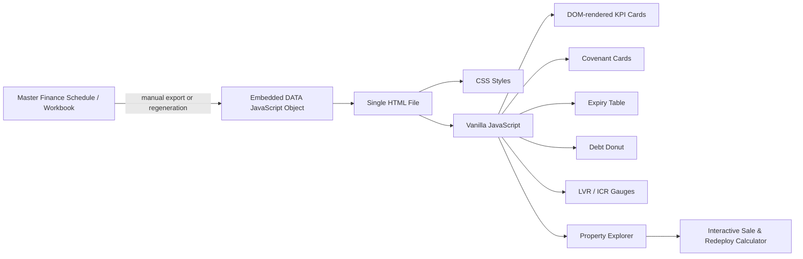
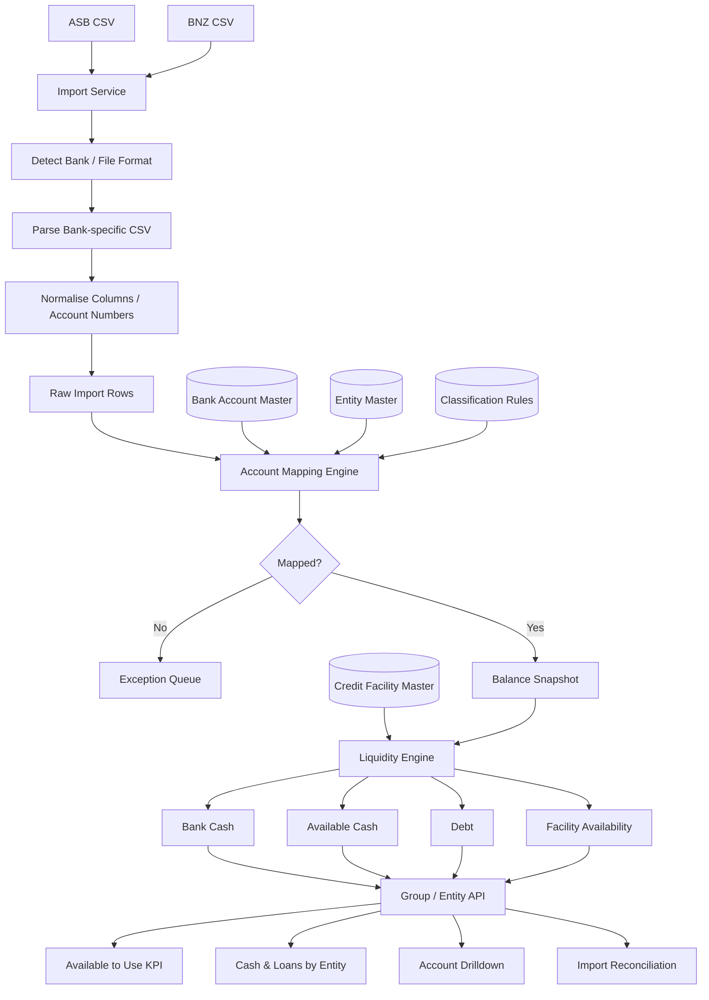
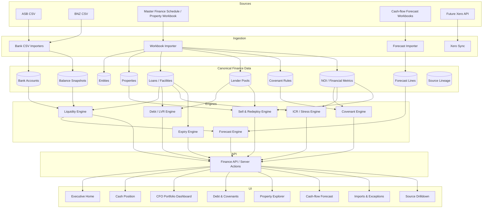
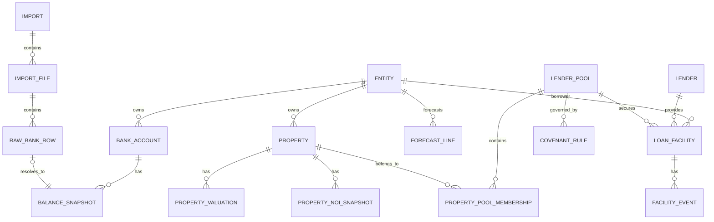
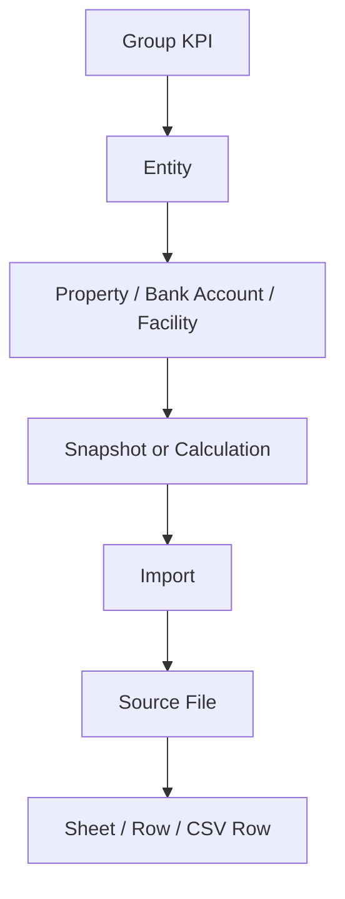

# Ramwall Finance Platform — Rebuild & Implementation Specification

**Scope:** Consolidated technical and functional reconstruction of:

1. **Ramwall Group CFO Dashboard** — directly inspected from `Ramwall_CFO_Dashboard_4.html`.
2. **Ramwall Finance · Cash Position** — reconstructed from prior project/site context.
3. **Recommended unified finance application architecture** — proposed implementation that combines both modules and fixes the weaknesses of the current static/CSV-driven approach.

**Prepared:** 25 August 2026  
**Primary purpose:** Give a developer / Claude Code / Codex enough context to rebuild the finance platform without needing the original applications open.

---

## 0. Evidence & confidence legend

This document deliberately separates what is **verified** from what is **reconstructed** or **proposed**.

| Label | Meaning |
|---|---|
| **VERIFIED — CFO HTML** | Directly present in the supplied `Ramwall_CFO_Dashboard_4.html`. |
| **RECOVERED — Cash Position** | Recovered from prior project context, screenshots and work on the Cash Position site. Treat as a functional reconstruction, not a byte-for-byte code dump. |
| **PROPOSED — New App** | Recommended architecture / implementation for the replacement platform. |

Do **not** assume that a proposed table, route or function existed in the old system unless it is explicitly marked as verified or recovered.

---

# PART A — CFO DASHBOARD

## 1. What the CFO Dashboard does

**VERIFIED — CFO HTML**

The dashboard is a management decision tool for the Ramwall Group portfolio. Its major functions are:

- Separate the **investment portfolio** from **development / held-for-sale assets**.
- Show portfolio KPIs:
  - market / bank value;
  - debt;
  - LVR;
  - NOI;
  - debt yield;
  - lending headroom.
- Show **covenant status** by lender.
- Track **loan term expiries** and **interest-rate re-fixes**.
- Show **drawn debt by lender**.
- Show **pool LVR vs release target**.
- Show **ICR by lender under a 7% stress rate**.
- Track the **GH Invest development facility**.
- Allow a user to click an individual property and model a **sell-and-redeploy scenario**.
- Calculate:
  - sale proceeds;
  - required lender paydown;
  - true cash released / top-up required;
  - NOI lost;
  - remaining pool ICR;
  - replacement purchase capacity;
  - yield required on the replacement asset.

The current HTML describes itself as a snapshot exported from the **Master Finance Schedule**.

---

## 2. Current CFO Dashboard architecture

**VERIFIED — CFO HTML**

This file is effectively a **single-file static application**:



### Important implementation characteristic

There is:

- no backend API;
- no database connection;
- no live workbook connection;
- no authentication visible in the HTML;
- no server-side calculation;
- no dynamic external data retrieval.

The finance data is hard-coded inside:

```js
const DATA = { ... }
DATA.split = { ... }
```

All visual output is built in the browser from this embedded object.

---

## 3. CFO Dashboard UI structure

**VERIFIED — CFO HTML**

The page is organised into these sections:

```text
Header
└── Ramwall Group — CFO Dashboard
    └── “Figures as at last workbook update”

Portfolio Snapshot
├── Investment portfolio
│   └── 5 KPI cards
└── Development
    └── 5 KPI cards

Covenant Status

Facility Expiry Watch

Position & Constraints
├── Drawn debt by lender
├── Pool LVR vs release target
├── ICR by lender — 7% stress
└── Development facility watch

Property Decisions
├── Asset list
└── Sell-and-redeploy calculator

Footer
└── Data-refresh and watch-item notes
```

Responsive CSS changes the 5-column KPI / covenant grids down to smaller grids on narrower screens.

---

## 4. CFO Dashboard styling system

**VERIFIED — CFO HTML**

The supplied dashboard uses a restrained finance / board-reporting palette:

| Variable | Purpose | Value |
|---|---|---|
| `--azure` | primary dark | `#102226` |
| `--azure2` | secondary dark | `#1d3d45` |
| `--azlt` | pale blue-green | `#CFE4EA` |
| `--bg` | page background | `#eef1f2` |
| `--card` | cards | `#fff` |
| `--green` | pass / positive | `#1a7f4b` |
| `--red` | breach / negative | `#c0392b` |
| `--amber` | warning | `#b7791f` |
| `--gold` | development / secondary finance | `#A67C34` |

Typography is the native Apple / Segoe / Helvetica / Arial stack.

---

# PART B — CFO DASHBOARD DATA MODEL & CURRENT FIGURES

## 5. Embedded top-level KPI object

**VERIFIED — CFO HTML**

| Metric | Embedded value |
|---|---:|
| Total MV | $88,334,000.00 |
| Bank value | $83,590,913.04 |
| Total debt | $45,730,694.23 |
| Overall LVR | 54.71% |
| Annual NOI | $2,925,847.11 |
| Debt yield | 6.40% |
| Headroom | $8,603,399.25 |
| `props` field | 36 |
| All-in ICR | 0.91x |
| Operating ICR | 1.11x |
| GH debt | $8,140,000.00 |
| GH maturity | 2027-05-14 |

---

## 6. Investment / development split

**VERIFIED — CFO HTML**

### Investment portfolio

| Metric | Value |
|---|---:|
| Investment value | $66,426,000.00 |
| Senior debt — ASB + BNZ | $37,590,694.23 |
| Investment LVR | 58.54% |
| Annual NOI | $2,925,847.11 |
| Debt yield | 7.78% |
| Senior capacity to 65% LVR | $4,150,355.77 |
| Investment count field | 29 |

### Development

| Metric | Value |
|---|---:|
| 124 Edinburgh Street / Notre Dame held for sale | $19,428,000.00 |
| Other development | $2,480,000.00 |
| GH Invest drawn | $8,140,000.00 |
| Development LVR | 42.02% |
| GH capacity to 60% LVR | $3,484,347.83 |

The HTML labels the “other development” amount as **Oiroa Grove / Bremner Rd**.

---

## 7. Covenant tests

**VERIFIED — CFO HTML**

| Lender | Test | Limit | Actual | Status |
|---|---|---:|---:|---|
| ASB | Max consolidated LVR | 65.0% | 62.0% | PASS |
| ASB | Min interest cover to 31/03/26 | 1.75x | 1.94x | PASS |
| ASB | Min interest cover from 31/03/27 | 1.95x | 1.94x | BREACH |
| BNZ | No express financial covenant | — | — | NOT A COVENANT |
| GH Invest | Max LVR (executed terms) | 60.0% | 42.0% | PASS |
| GH Invest | Min repayment to cure 60% LVR | — | 0.0% | PASS |

### Covenant interpretation coded in the UI

The status helper classifies statuses containing:

- `BREACH`, `SHORTFALL`, `ACTION` → red;
- `PASS`, `OK` → green;
- anything else → amber.

### Key live watch item embedded in the dashboard

The ASB interest-cover requirement is coded as increasing to **1.95x from 31 March 2027**, while the embedded actual is approximately **1.94x**, so it renders as a breach / watch item.

---

## 8. Debt by lender

**VERIFIED — CFO HTML**

| Lender | Drawn debt |
|---|---:|
| ASB | $28,123,379.60 |
| BNZ | $9,467,314.63 |
| GH Invest | $8,140,000.00 |

Total drawn debt represented by the lender donut:

**$45,730,694.23**

---

## 9. Lending pool data

**VERIFIED — CFO HTML**

| Pool | Value | Debt | NOI | LVR | ICR @ 7% stress | Target LVR |
|---|---:|---:|---:|---:|---:|---:|
| ASB | $45,337,000.00 | $28,123,379.60 | $2,623,555.97 | 62.0% | 1.33x | 65.0% |
| BNZ | $14,940,000.00 | $9,467,314.63 | $253,721.48 | 63.4% | 0.38x | 65.0% |
| Unallocated | $0.00 | $0.00 | $0.00 | — | — | 0.0% |
| Unencumbered | $3,940,000.00 | $0.00 | $48,569.66 | 0.0% | — | 0.0% |
| GH Invest | $19,373,913.04 | $8,140,000.00 | $0.00 | 42.0% | 0.00x | 65.0% |

### Important behaviour

The pool-LVR visual uses:

```text
Pool LVR = pool debt / pool value
```

and compares it with each pool's `target_lvr`.

The HTML specifically states that these are **cross-collateralised pools** and sale-release should be tested against the pool rather than an individual property's standalone LVR.

---

## 10. Lender ICR view

**VERIFIED — CFO HTML**

| Lender | Debt | NOI mapped | Current ICR | ICR @ 7% | LVR |
|---|---:|---:|---:|---:|---:|
| ASB | $28,123,379.60 | $2,623,555.97 | 1.94x | 1.33x | 62.0% |
| BNZ | $9,467,314.63 | $253,721.48 | 0.54x | 0.38x | 63.4% |
| GH Invest | $8,140,000.00 | $0.00 | 0.00x | 0.00x | 42.0% |

### ICR calculation

For the stressed management view:

```text
ICR @ 7% = NOI / (Debt × 7%)
```

### Special lender treatment

**GH Invest** is excluded from the ordinary serviceability read because the dashboard treats it as:

- development debt;
- interest capitalised;
- no serviceable income;
- bullet repayment at maturity.

### BNZ mapping caveat encoded in the dashboard

The dashboard explicitly warns that BNZ's ICR is understated because only a portion of NOI is mapped to BNZ-secured assets and says this is a **mapping gap**, not necessarily a live covenant breach.

---

# PART C — FACILITY EXPIRY / RATE REFIX WATCH

## 11. Expiry-watch logic

**VERIFIED — CFO HTML**

The dashboard separately distinguishes:

- `RATE` → rate re-fix;
- `TERM` → facility maturity.

It categorises timing as:

```text
months < 0       → OVERDUE
0–3 months       → URGENT
>3–12 months     → SOON
>12 months       → WATCH
```

Embedded total within 12 months:

- **$12,023,927.36**
- across **5 facilities**

## 12. Embedded expiry events

| Lender | Facility | Event | Date | Relative timing in embedded data | Balance |
|---|---|---|---|---:|---:|
| ASB | ASB Loan 18 | Rate re-fix | 2026-05-27 | -2.4 months | $1,604,568.59 |
| ASB | Business Term 015 | Term expiry | 2026-07-09 | -1.0 months | $1,646,651.53 |
| ASB | Commercial Lending 019 | Term expiry | 2026-07-09 | -1.0 months | $580,807.33 |
| ASB | Commercial Lending 018 | Term expiry | 2027-01-13 | 5.1 months | $51,899.91 |
| ASB | ASB Loan 18 | Term expiry | 2027-02-26 | 6.6 months | $1,604,568.59 |
| GH Invest | GH Invest Facility | Term expiry | 2027-05-14 | 9.2 months | $8,140,000.00 |
| BNZ | Housing Term Loan 1841-00006 | Rate re-fix | 2027-11-22 | 15.4 months | $1,956,173.52 |
| BNZ | Housing Term Loan 00007 | Rate re-fix | 2027-11-22 | 15.4 months | $1,944,641.11 |
| ASB | Commercial Lending 011 | Term expiry | 2028-01-13 | 17.1 months | $746,389.06 |
| ASB | Commercial Lending 014 | Term expiry | 2028-01-13 | 17.1 months | $3,200,000.00 |
| ASB | Commercial Lending 016 | Term expiry | 2028-01-13 | 17.1 months | $9,736.58 |
| ASB | Commercial Lending 017 | Term expiry | 2028-01-13 | 17.1 months | $1,560,000.00 |
| ASB | Commercial Lending 020 | Term expiry | 2028-01-13 | 17.1 months | $992,074.29 |
| ASB | Commercial Lending 012 | Term expiry | 2028-01-13 | 17.1 months | $1,296,957.60 |
| ASB | Commercial Lending 012 | Rate re-fix | 2028-01-13 | 17.1 months | $1,296,957.60 |

**Implementation note:** the `months` numbers are precomputed in the embedded dataset. A rebuilt app should derive them from `event_date - as_of_date` rather than store them as authoritative values.

---

# PART D — PROPERTY DECISION ENGINE

## 13. Property explorer

**VERIFIED — CFO HTML**

The embedded explorer array currently contains **27 assets**.

### Distribution in the embedded explorer

**By entity**

- Vikat Holdings Limited: 5
- Kerrs Village Limited: 2
- Kayo Investments Limited: 20

**By lending pool**

- ASB: 24
- BNZ: 1
- Unencumbered: 2

**By displayed decision**

- HOLD*: 1
- IMPROVE: 1
- RECYCLE TEST: 21
- CORE HOLD: 4

### Data consistency warning

The embedded data contains several different portfolio-count concepts:

- `DATA.kpi.props` = **36**
- `DATA.split.inv.count` = **29**
- `DATA.properties.length` = **27**

These may represent different scopes, but the current single-file application does not document the reconciliation. The replacement app should define explicit scopes such as:

```text
all_assets
investment_assets
development_assets
held_for_sale_assets
decision_explorer_assets
```

and calculate counts from the database rather than store independent manual totals.

---

## 14. Property dataset embedded in the HTML

**VERIFIED — CFO HTML**

| # | Property | Entity | Pool | Bank/value field | NOI | Yield | Decision |
|---:|---|---|---|---:|---:|---:|---|
| 1 | 2 Kerrs Road, Manukau | Vikat Holdings Limited | ASB | $11,600,000 | $1,038,948.27 | 8.96% | HOLD UNLESS STRATEGIC SALE |
| 2 | 2 Rogers Road, Manurewa | Kerrs Village Limited | BNZ | $5,140,000 | $253,721.48 | 4.94% | HOLD / IMPROVE - POOL ICR WEAK |
| 3 | 1 Hogan Street, Pukekohe [Lot 2] | Kayo Investments Limited | ASB | $800,000 | $31,272.05 | 3.91% | RECYCLE TEST |
| 4 | 142 Edinburgh Street, Pukekohe (Lot3) | Kayo Investments Limited | ASB | $746,000 | $30,557.89 | 4.10% | RECYCLE TEST |
| 5 | 152C Browns Road, Manurewa | Kayo Investments Limited | ASB | $814,000 | $38,135.25 | 4.68% | RECYCLE TEST |
| 6 | 152D Browns Road, Manurewa | Kayo Investments Limited | ASB | $784,000 | $38,149.06 | 4.87% | RECYCLE TEST |
| 7 | 152B Browns Road, Manurewa | Kayo Investments Limited | ASB | $806,000 | $38,074.62 | 4.72% | RECYCLE TEST |
| 8 | 290 Tristram St, Hamiltom | Vikat Holdings Limited | ASB | $1,670,000 | $128,122.13 | 7.67% | CORE HOLD |
| 9 | 30 Wellington Street, Hamilton | Vikat Holdings Limited | ASB | $3,200,000 | $191,958.07 | 6.00% | RECYCLE TEST |
| 10 | 152A Browns Road, Manurewa | Kayo Investments Limited | ASB | $830,000 | $37,746.24 | 4.55% | RECYCLE TEST |
| 11 | 44 Aurora Tce, Hamilton | Vikat Holdings Limited | ASB | $829,000 | $68,266.01 | 8.23% | CORE HOLD |
| 12 | Unit C4, 3/8 Kerrs Road | Kayo Investments Limited | Unencumbered | $480,000 | $11,198.81 | 2.33% | RECYCLE TEST |
| 13 | A4 - 16 Wallson Crescent | Kayo Investments Limited | ASB | $701,000 | $15,896.78 | 2.27% | RECYCLE TEST |
| 14 | 6B Martin Road, Manurewa | Kerrs Village Limited | Unencumbered | $910,000 | $37,370.85 | 4.11% | RECYCLE TEST |
| 15 | 103 Malaspina Place, Papatoetoe | Kayo Investments Limited | ASB | $625,000 | $26,606.39 | 4.26% | RECYCLE TEST |
| 16 | Unit G6, 6/3 Wallson Crescent, Wiri, Manukau | Kayo Investments Limited | ASB | $580,000 | $16,248.03 | 2.80% | RECYCLE TEST |
| 17 | Unit H4, 3/5 Wallson Crescent, Wiri, Manukau | Kayo Investments Limited | ASB | $574,000 | $15,487.46 | 2.70% | RECYCLE TEST |
| 18 | Unit F3, 8/4 Wallson Crescent, Wiri, Manukau | Kayo Investments Limited | ASB | $565,000 | $14,821.28 | 2.62% | RECYCLE TEST |
| 19 | 146 River Road, Hamilton | Kayo Investments Limited | ASB | $1,900,000 | $187,718.37 | 9.88% | CORE HOLD |
| 20 | Unit D3-3/1 Wallson Crescent | Kayo Investments Limited | ASB | $460,000 | $11,821.22 | 2.57% | RECYCLE TEST |
| 21 | Unit E5, 5/4 Wallson Crescent, Wiri, Manukau | Kayo Investments Limited | ASB | $350,000 | $8,855.51 | 2.53% | RECYCLE TEST |
| 22 | A1 - 22 Wallson Crescent | Kayo Investments Limited | ASB | $602,000 | $3,347.93 | 0.56% | RECYCLE TEST |
| 23 | 20 Avon Street, Hamilton | Kayo Investments Limited | ASB | $2,000,000 | $142,936.98 | 7.15% | CORE HOLD |
| 24 | 6A Martin Road, Manurewa | Kayo Investments Limited | ASB | $852,000 | $37,721.15 | 4.43% | RECYCLE TEST |
| 25 | 37 Kelvin Road & 79 Willis Road, Papakura | Kayo Investments Limited | ASB | $9,950,000 | $495,571.90 | 4.98% | RECYCLE TEST |
| 26 | 6 Martin Road, Manurewa | Kayo Investments Limited | ASB | $674,000 | $16,567.49 | 2.46% | RECYCLE TEST |
| 27 | 367 Great South Road, Greenlane | Vikat Holdings Limited | ASB | $3,425,000 | $-11,274.11 | -0.33% | RECYCLE TEST |

---

## 15. Separate market-value override list

**VERIFIED — CFO HTML**

The property calculator does **not** use only the `value` field in each property object.

It sets:

```js
p.bv = p.value;
p.mv = MVLIST[ix] ?? p.value;
```

So:

- `p.bv` = bank valuation / covenant reference;
- `p.mv` = market value from a **separate positional `MVLIST` array**.

### Why this matters

This is fragile because the `MVLIST` values depend on array order:

```text
properties[0] ↔ MVLIST[0]
properties[1] ↔ MVLIST[1]
...
```

If a property is inserted, deleted or reordered without synchronising `MVLIST`, market values can be assigned to the wrong asset.

**PROPOSED — New App:** store `bank_value` and `market_value` as fields against the same stable `property_id`.

---

# PART E — SELL & REDEPLOY CALCULATOR

## 16. User-controlled inputs

**VERIFIED — CFO HTML**

The property calculator lets the user change:

1. **Sale price**
2. **Selling commission**
   - default: 2.5%
   - slider: 0%–4%
3. **Pool revaluation haircut**
   - default: 0%
   - slider: 0%–20%
4. **Replacement gearing / LVR**
   - default: 60%
   - slider: 0%–75%

---

## 17. Calculation sequence

**VERIFIED — CFO HTML**

For selected property `p`:

### 17.1 Retained pool value after sale and haircut

```text
retained_pool_value
= MAX(0, pool_value - property_bank_value)
  × (1 - haircut)
```

### 17.2 Maximum debt allowed after release

```text
max_debt
= retained_pool_value × target_LVR
```

### 17.3 Required lender repayment

```text
release_repayment
= MAX(0, current_pool_debt - max_debt)
```

This repayment is driven by **bank valuation and pool covenant mechanics**, not the user's sale price.

### 17.4 Net sale proceeds

```text
net_sale_proceeds
= sale_price × (1 - commission_pct)
```

### 17.5 True cash released

```text
cash_released
= net_sale_proceeds - release_repayment
```

### 17.6 Top-up required

```text
top_up
= MAX(0, release_repayment - net_sale_proceeds)
```

### 17.7 Sale below bank value

```text
bank_value_shortfall
= MAX(0, property_bank_value - sale_price)
```

### 17.8 NOI lost

```text
NOI_lost = property_NOI
```

### 17.9 Remaining pool

```text
remaining_NOI
= pool_NOI - property_NOI

debt_after
= pool_debt - release_repayment
```

### 17.10 Remaining pool ICR

```text
remaining_ICR
= remaining_NOI / (debt_after × stress_rate)
```

The embedded stress rate is generally 7%.

### 17.11 Replacement purchase capacity

If cash released is positive:

```text
replacement_purchase_capacity
= cash_released / (1 - replacement_LVR)
```

### 17.12 Yield required to replace lost NOI

```text
required_replacement_yield
= NOI_lost / replacement_purchase_capacity
```

---

## 18. Decision / verdict logic

**VERIFIED — CFO HTML**

The calculator produces three broad outcomes:

### A. Top-up required

If net proceeds do not cover the covenant release repayment:

```text
Top-up required
```

### B. Cash releases, but pool serviceability breaks

If remaining ICR falls below 1.0x:

```text
Cash releases, but the remaining pool breaks serviceability.
```

### C. Viable release

If there is positive cash release and retained ICR remains viable:

```text
Viable release.
```

The UI then explains:

- amount of cash freed;
- remaining pool ICR;
- potential replacement acquisition capacity;
- yield required to replace the NOI sold.

---

# PART F — CFO DASHBOARD TECHNICAL ISSUES TO FIX

## 19. Static-data architecture

**VERIFIED — CFO HTML**

The current file must be regenerated or have its `DATA` block replaced to refresh results.

**Replacement requirement:** database / API-driven live state.

---

## 20. “As at” date is not truly the workbook date

**VERIFIED — CFO HTML**

The header says:

```text
Figures as at last workbook update
```

but the JavaScript sets the displayed date using the browser's current date:

```js
new Date().toLocaleDateString(...)
```

Therefore the displayed as-at date can be later than the actual source-workbook data.

**Replacement requirement:** every dataset must carry a real:

```text
source_as_of_date
source_updated_at
imported_at
```

---

## 21. Positional market-value mapping

As described above, `MVLIST[ix]` creates a data-integrity risk.

**Replacement:** attach values to stable property IDs.

---

## 22. Precomputed fields can drift

The embedded object contains both source values and derived totals such as:

- total debt;
- portfolio LVR;
- investment LVR;
- headroom;
- expiry count / total;
- property count.

A database system should recompute derived values from atomic records to avoid stale totals.

---

## 23. No source lineage in the UI

The user cannot click a KPI and see:

```text
KPI
→ lender / property / facility
→ source workbook tab
→ source row
→ import timestamp
```

This should become a core feature of the replacement system.

---

# PART G — CASH POSITION SITE

## 24. What Cash Position is intended to do

**RECOVERED — Cash Position**

The Cash Position module answers:

> **How much cash / liquidity is actually available to deploy right now, and where is it held?**

It is not intended to merely sum every balance appearing in uploaded bank files.

Key outputs include:

- total bank cash;
- **available cash / available to use**;
- cash by legal entity;
- loans / debt by entity;
- available revolving-credit capacity;
- group-level consolidated liquidity.

A visible section previously used the wording:

```text
Cash and loans by entity
```

and the headline used wording similar to:

```text
$X available to use
```

---

## 25. Recovered Cash Position technology stack

**RECOVERED — Cash Position**

Previous project context identified the stack as:

```text
Next.js 16
React 19
TypeScript
Cloudflare Workers
Cloudflare D1
Drizzle ORM
```

This is suitable for the rebuild and can also host the CFO module.

---

## 26. Bank-import business rules

**RECOVERED — Cash Position**

### Bank detection

Known account-number prefixes:

```text
12-... → ASB
02-... → BNZ
```

### Available-cash concept

Do **not** automatically include:

- loan accounts;
- term debt;
- ordinary overdraft/debt balances as if they are positive cash;
- savings / reserve accounts unless specifically approved as deployable;
- statutory accounts;
- GST / tax / PAYE / wage-reserve accounts where restricted;
- unmapped / unassigned accounts.

### Special liquidity treatment

The recovered design explicitly treated the **Vikat Credit Facility** as available liquidity.

The correct economic treatment is:

```text
Available revolving liquidity
= Facility limit - Amount drawn
```

not:

```text
Available cash = cash + loan balance
```

---

## 27. Cash Position calculation definitions

**RECOVERED / RECOMMENDED**

### Bank cash

```text
Bank Cash
= Σ latest balances of accounts explicitly classified as bank cash
```

### Unrestricted / available cash

```text
Available Cash
= Σ latest balances of accounts where include_in_available_cash = true
```

### Available revolving liquidity

```text
Facility Available
= MAX(0, Facility Limit - Current Drawn)
```

### Available to use

```text
Available to Use
= Available Cash + Available Revolving Liquidity
```

### Debt

```text
Debt Outstanding
= Σ debt / loan / facility drawn amounts
```

Debt should be presented as a positive management number even if bank exports encode it with a negative sign.

---

## 28. Historical / recovered Cash Position figures

**RECOVERED — not current source of truth**

Prior work around the site produced different apparent headline values, including approximately:

```text
Bank balance:       $1.392m
Available cash:     $611k
```

while a later displayed site state showed approximately:

```text
Available to use:   $547k
```

These figures should **not** be hard-coded into the new app. Their mismatch is evidence that the classification / mapping logic needs auditability.

The rebuild should make it possible to explain every difference account-by-account.

---

# PART H — CASH POSITION IMPORT ARCHITECTURE

## 29. Required data-flow design

**PROPOSED — New App**



---

## 30. Strict separation of responsibilities

The rebuild should enforce:

```text
CSV Parser
    ↓
Normalisation
    ↓
Account Mapping
    ↓
Finance Classification
    ↓
Calculation Engine
    ↓
API
    ↓
UI
```

### Parser must NOT decide accounting treatment

Bad:

```js
if (accountName.includes("loan")) ...
```

as the primary control.

Preferred:

```text
Imported account number
→ Bank Account Master
→ explicit classification
→ explicit inclusion flags
```

---

# PART I — UNIFIED FINANCE APPLICATION

## 31. Target architecture

**PROPOSED — New App**

The CFO Dashboard and Cash Position should become modules of one platform.



---

# PART J — UNIFIED DATA MODEL

## 32. Core entities

**PROPOSED — New App**



---

## 33. Suggested tables

### `entities`

```text
id
legal_name
short_name
entity_type
active
```

### `bank_accounts`

```text
id
entity_id
bank
account_number
display_name
account_type
include_in_bank_cash
include_in_available_cash
include_in_debt
active
```

### `balance_snapshots`

```text
id
bank_account_id
import_id
balance
available_balance
as_of_date
source_row_id
created_at
```

### `lenders`

```text
id
name
lender_type
```

### `loan_facilities`

```text
id
entity_id
lender_id
pool_id
facility_reference
facility_type
facility_limit
drawn_amount
interest_rate
interest_capitalised
include_in_available_liquidity
maturity_date
active
```

### `facility_events`

```text
id
facility_id
event_type        // RATE_REFIX | TERM_EXPIRY
event_date
source
```

### `properties`

```text
id
entity_id
name
address
asset_type
status            // INVESTMENT | DEVELOPMENT | HELD_FOR_SALE
decision_status
active
```

### `property_valuations`

```text
id
property_id
valuation_type    // BANK | MARKET | COST
value
valuation_date
valuer
source_id
```

### `property_noi_snapshots`

```text
id
property_id
annual_noi
as_of_date
source_id
```

### `lender_pools`

```text
id
lender_id
name
target_lvr
stress_rate
active
```

### `property_pool_memberships`

```text
property_id
pool_id
effective_from
effective_to
```

### `covenant_rules`

```text
id
pool_id / lender_id
metric_type       // LVR | ICR
operator          // <= | >=
threshold
effective_from
effective_to
source_id
```

### `imports`

```text
id
import_type
source_name
source_as_of_date
file_hash
status
imported_at
imported_by
```

### `raw_bank_rows`

```text
id
import_file_id
source_row_number
raw_account_number
raw_account_name
raw_balance
raw_available_balance
raw_payload
```

### `forecast_lines`

```text
id
entity_id
scenario
period_start
period_end
category
inflow
outflow
source_id
```

### `source_lineage`

```text
id
source_type
source_file
sheet_name
cell_or_row_reference
source_as_of_date
import_id
```

---

# PART K — API DESIGN

## 34. Recommended routes

**PROPOSED — New App**

### Executive / dashboard

```text
GET /api/executive/summary
GET /api/executive/watch-items
```

### Cash position

```text
GET  /api/liquidity/group
GET  /api/liquidity/entities
GET  /api/liquidity/entities/:entityId
GET  /api/liquidity/accounts/:accountId
```

### Imports

```text
POST /api/imports/bank
POST /api/imports/workbook
GET  /api/imports
GET  /api/imports/:id
GET  /api/imports/:id/reconciliation
GET  /api/imports/:id/exceptions
```

### Accounts / mappings

```text
GET   /api/bank-accounts
PATCH /api/bank-accounts/:id
POST  /api/mapping-exceptions/:id/resolve
```

### Portfolio

```text
GET /api/portfolio/summary
GET /api/properties
GET /api/properties/:id
GET /api/lender-pools
```

### Covenants

```text
GET /api/covenants/current
GET /api/covenants/stress
```

### Facilities

```text
GET /api/facilities
GET /api/facilities/events
```

### Property modelling

```text
POST /api/properties/:id/sell-redeploy
```

### Forecast

```text
GET  /api/forecast/group
GET  /api/forecast/entities/:entityId
POST /api/forecast/import
```

---

# PART L — FRONTEND MODULES

## 35. Recommended Next.js structure

```text
app/
  page.tsx

  cash-position/
    page.tsx

  portfolio/
    page.tsx

  debt/
    page.tsx

  covenants/
    page.tsx

  properties/
    page.tsx
    [propertyId]/
      page.tsx

  forecast/
    page.tsx

  imports/
    page.tsx
    [importId]/
      page.tsx

  admin/
    accounts/
    entities/
    pools/
    covenants/

lib/
  imports/
    asb-parser.ts
    bnz-parser.ts
    workbook-parser.ts
    normalize-account-number.ts

  mapping/
    account-mapper.ts
    property-mapper.ts

  liquidity/
    calculate-bank-cash.ts
    calculate-available-cash.ts
    calculate-facility-availability.ts
    calculate-entity-liquidity.ts

  portfolio/
    calculate-lvr.ts
    calculate-headroom.ts
    calculate-debt-yield.ts

  covenants/
    evaluate-covenant.ts

  stress/
    calculate-icr.ts

  facilities/
    calculate-expiry-status.ts

  property-model/
    sell-redeploy.ts

  forecast/
    calculate-cashflow.ts

db/
  schema.ts
  queries/

components/
  executive/
  cash/
  debt/
  property/
  covenant/
  forecast/
  import/
```

---

# PART M — CALCULATION ENGINE REQUIREMENTS

## 36. One source of truth for calculations

**PROPOSED — New App**

React components must **never independently calculate finance KPIs**.

Correct pattern:

```text
database
→ finance calculation engine
→ typed result
→ API / server action
→ UI component
```

Wrong pattern:

```text
UI component
→ re-implements LVR / ICR / liquidity formula
```

---

## 37. LVR

```text
LVR = Drawn Debt / Eligible Secured Value
```

The calculation must clearly distinguish:

- bank valuation;
- market valuation;
- development value;
- held-for-sale value;
- investment value.

---

## 38. Headroom

Example:

```text
Debt Capacity at Target LVR
= Eligible Value × Target LVR

Headroom
= MAX(0, Debt Capacity - Drawn Debt)
```

---

## 39. Debt yield

```text
Debt Yield = NOI / Debt
```

The CFO HTML's investment card uses NOI against senior debt.

---

## 40. ICR

```text
ICR = NOI / Interest Cost
```

For 7% management stress:

```text
Stress Interest = Debt × 7%
Stress ICR = NOI / Stress Interest
```

The engine must distinguish:

- actual covenant ICR definition;
- management stress ICR;
- lender-specific exclusions / definitions.

Do not assume every lender covenant is identical.

---

## 41. Sale-release engine

Carry over the verified CFO formulas from Sections 16–18, but the new engine should accept explicit parameters:

```ts
type SellRedeployInput = {
  propertyId: string;
  salePrice: number;
  sellingCostPct: number;
  retainedPoolHaircutPct: number;
  replacementLvr: number;
  asOfDate: string;
};
```

and return a fully auditable result including intermediate variables.

---

# PART N — IMPORT CONTROLS & DATA QUALITY

## 42. File hash / duplicate prevention

On import:

```text
file_hash = SHA256(file_bytes)
```

If already imported:

```text
Duplicate upload detected
Previously imported: <timestamp>
```

The app should not double-count snapshot files.

---

## 43. Latest-snapshot rule

Cash balances are **point-in-time balances**, not additive transactions.

For each account:

```text
Current balance
= latest valid balance snapshot at or before dashboard as-of date
```

Never:

```text
current cash = sum(all uploaded balance snapshots)
```

---

## 44. Mapping exception queue

Any unknown account should be excluded from management totals until resolved.

Example:

```text
UNMAPPED BANK ACCOUNT
Account: 12-xxxx-xxxxxxx-xx
Description: RAMWALL RESERVE
Balance: $82,000

Required:
- entity
- account type
- available-cash treatment
- debt treatment
```

---

## 45. Reconciliation screen before publish

After importing bank data:

```text
ASB
Accounts read:             18
Mapped:                    17
Unmapped:                   1

BNZ
Accounts read:              9
Mapped:                     9
Unmapped:                   0

Bank cash:             $X
Restricted cash:       $X
Available cash:        $X
Loans detected:        $X
Facility availability: $X

Publish snapshot?
```

The dashboard should not silently update if unresolved exceptions exist above a defined threshold.

---

## 46. Import validation tests

Automatically flag:

```text
duplicate file
duplicate account row
invalid account number
unknown bank
unknown account
unknown entity
missing balance
non-numeric balance
unexpected sign
account classification changed
account disappeared since previous import
large balance movement
facility drawn > facility limit
valuation materially changed
property lost its lender-pool mapping
NOI missing from secured property
covenant definition missing
```

---

# PART O — TRACEABILITY

## 47. Non-negotiable drilldown

Every headline number should support:



Examples:

```text
Available to Use
→ Vikat
→ BNZ Credit Facility
→ facility limit / drawn balance
→ latest import
→ source row
```

and:

```text
ASB LVR
→ ASB lending pool
→ secured properties
→ latest bank valuations
→ ASB debt facilities
→ source workbook / facility record
```

---

# PART P — CASH-FLOW FORECAST EXTENSION

## 48. Kayo / Vikat / Kerrs forecast module

**PROPOSED — New App**

The Cash Position architecture should support forecasts for:

- Kayo Investments Limited;
- Vikat Holdings Limited;
- Kerrs Village Limited.

Weekly logic:

```text
Closing Cash
= Opening Cash
+ Cash Inflows
- Cash Outflows

Next Week Opening Cash
= Current Week Closing Cash
```

Suggested categories:

```text
rent receipts
other operating income
management fees
rates
insurance
repairs & maintenance
utilities
payroll / salary recharges
interest
principal repayments
GST / tax
capex
development funding
intercompany transfers
property settlements
one-off receipts / payments
```

---

## 49. Forward-liquidity KPIs

The executive dashboard should eventually show:

```text
Available today
4-week minimum liquidity
12-week minimum liquidity
date of minimum liquidity
funding shortfall
facility headroom
next material loan expiry
next covenant pressure point
```

Example conceptual output:

```text
Available today          $611k
4-week low               $284k
12-week low             -$120k
Funding gap starts       Week ending XX
```

Numbers above are illustrative only.

---

# PART Q — RECOMMENDED EXECUTIVE HOME

## 50. Unified landing page

The best rebuild should not force management to choose between two disconnected sites.

Recommended top-level view:

```text
RAMWALL FINANCE

LIQUIDITY
Available to Use
Bank Cash
4-Week Low
12-Week Low

PORTFOLIO
Investment Value
Senior Debt
Investment LVR
NOI / Debt Yield

RISK
Covenant Status
Upcoming Expiries
ICR Stress
Development Bullet

CAPITAL ALLOCATION
Properties to Review
Potential Cash Release
Unencumbered Assets
Development / Held for Sale

ALERTS
Unmapped Bank Accounts
Missing NOI
Overdue Refixes
Covenant Headroom
Forecast Funding Gaps
```

Clicking any KPI should drill into the underlying ledger / property / facility detail.

---

# PART R — CURRENT CFO DATA ANOMALIES / ITEMS TO VALIDATE

## 51. Portfolio-count reconciliation

As noted:

```text
KPI props       = 36
Investment count = 29
Explorer assets  = 27
```

Document and reconcile the intended scope.

---

## 52. BNZ NOI mapping

The current dashboard itself says BNZ-secured income is incompletely mapped and specifically references trust-held rentals not fully flowing into the NOI tab.

This should become a formal data-quality exception rather than a footnote.

---

## 53. Overdue / historical expiry items

Some embedded rate or term events are already before the dashboard date. The existing UI asks the user to confirm they have been rolled.

The replacement app should provide:

```text
event status
new refix date
new maturity date
confirmed by
confirmed at
source document
```

so resolved events are not repeatedly presented as overdue.

---

## 54. GH Invest

The app currently treats GH Invest separately because:

```text
development debt
8% p.a.
interest capitalised
bullet maturity
18% default rate if unpaid
```

The replacement system should model this explicitly in the facility master rather than encode it only in explanatory UI text.

---

# PART S — SECURITY / GOVERNANCE

## 55. Roles

Recommended:

```text
Admin
- configure entities, mappings, facilities, covenants
- resolve imports
- publish snapshots

Finance Controller
- import / review
- model scenarios
- approve mapping changes
- access all finance views

Finance Team
- upload files
- review exceptions
- view dashboards

Board / Read Only
- dashboard and drilldown
- no edits
```

---

## 56. Audit log

Log:

```text
file uploads
mapping changes
classification changes
facility changes
valuation changes
covenant threshold changes
forecast imports
manual overrides
snapshot publication
scenario assumptions
```

For every change:

```text
who
what
old value
new value
when
source / reason
```

---

# PART T — IMPLEMENTATION PRIORITY

## 57. Phase 1 — canonical data layer

Build first:

1. Entities
2. Bank accounts
3. Properties
4. Lenders
5. Facilities
6. Lender pools
7. Valuations
8. NOI
9. Covenant rules
10. Import / source lineage

Do not start by copying the dashboard cards.

---

## 58. Phase 2 — Cash Position

Build:

```text
ASB parser
BNZ parser
account mapping
exception queue
balance snapshots
liquidity engine
cash-by-entity
available-to-use KPI
import reconciliation
```

This creates the most immediate operational control.

---

## 59. Phase 3 — CFO portfolio dashboard

Migrate:

```text
investment / development split
debt by lender
pool LVR
covenants
ICR stress
facility expiry watch
GH Invest
```

All values should be derived from the new canonical database.

---

## 60. Phase 4 — property sell / redeploy model

Move the verified calculator into a tested backend finance function and expose it through the property UI.

Write unit tests for every intermediate formula.

---

## 61. Phase 5 — cash-flow forecast

Add Kayo, Vikat and Kerrs forecasts and connect opening cash directly to the Cash Position snapshot.

---

## 62. Phase 6 — Xero / automated sources

Once deterministic finance logic is trusted, add Xero or other integrations.

Do **not** make an AI model responsible for basic balance classification or covenant arithmetic.

AI can assist with:

```text
exception explanation
document extraction
variance commentary
management summaries
question answering
forecast commentary
suggested investigations
```

but deterministic code should own the numbers.

---

# PART U — TEST SUITE

## 63. Minimum tests

### Cash

```text
same CSV uploaded twice → no double count
unknown account → excluded + exception
loan account → debt, not cash
statutory account → excluded from available cash
facility undrawn amount → included only when approved
latest snapshot wins
entity totals sum to group total
```

### CFO

```text
portfolio LVR formula
pool LVR formula
headroom formula
debt yield
current ICR
7% stress ICR
covenant effective-date threshold
expiry classification
development debt exclusion from serviceability
```

### Sale / redeploy

```text
zero commission
sale below bank valuation
sale above bank valuation
zero haircut
20% haircut
no cash release
top-up required
debt fully repaid
replacement LVR = 0%
replacement LVR = 75%
NOI negative
```

---

# PART V — DEVELOPER HANDOFF PROMPT

## 64. Core instruction for Claude Code / Codex

Use the following principles when implementing the new app:

```text
Build a unified Ramwall Finance platform that contains both Cash Position
and the CFO Portfolio Dashboard.

Do not copy the old static-data architecture.

All financial data must resolve to canonical records with stable IDs.

Bank CSV parsers are responsible only for reading and normalising source data.
They must not infer economic treatment from a positive balance or account name.

All bank-account treatment must come from an explicit Bank Account Master.

Unknown accounts must be excluded from management liquidity until mapped.

All headline finance calculations must live in deterministic calculation
services and must not be reimplemented inside React components.

CFO portfolio calculations must use effective-dated lender pools,
facility balances, property valuations, NOI and covenant definitions.

The sell-and-redeploy model must preserve the verified original logic:
release repayment is determined from retained pool value and target LVR,
not from the user's sale price.

Every KPI must be drillable to:
KPI → entity → property/account/facility → snapshot → import → source row.

Every import must be auditable, duplicate-safe and reconciliation-first.

The application should use the recovered stack:
Next.js 16, React 19, TypeScript, Cloudflare Workers, Cloudflare D1
and Drizzle ORM unless there is a deliberate migration decision.

Design the database and finance engines first.
Build the visual dashboard on top of those engines second.
```

---

# PART W — WHAT TO KEEP VS REPLACE

## 65. Keep

From the CFO Dashboard:

- investment vs development separation;
- simple board-quality visual hierarchy;
- covenant cards;
- expiry watch;
- lender debt mix;
- pool LVR view;
- 7% stress management ICR;
- sell-and-redeploy decision model;
- explicit development-debt treatment;
- concise decision labels.

From Cash Position:

- entity-level liquidity;
- “available to use” concept;
- direct ASB / BNZ file ingestion;
- consolidated group view;
- separate debt and cash;
- facility liquidity.

---

## 66. Replace

Do not retain:

- hard-coded `DATA` object as the production data store;
- browser-current date masquerading as workbook as-of date;
- positional `MVLIST` property mappings;
- independent manually precomputed totals;
- silent handling of unknown bank accounts;
- adding every positive bank balance into liquidity;
- duplication-sensitive CSV logic;
- UI calculations that cannot be traced to a source;
- finance definitions embedded only in labels / footnotes.

---

# PART X — FINAL TARGET STATE

## 67. System principle

The target system should be:

```text
SOURCE DATA
    ↓
CONTROLLED IMPORT
    ↓
CANONICAL FINANCE DATA
    ↓
DETERMINISTIC CALCULATION ENGINES
    ↓
AUDITABLE API
    ↓
EXECUTIVE DASHBOARDS + DRILLDOWN
    ↓
FORECAST + DECISION MODELLING
```

The desired end state is that a management user can click any number, for example:

```text
Available to Use
Investment LVR
ASB ICR
$12.0m of Upcoming Expiries
True Cash Released on a Property Sale
```

and trace exactly how the number was produced.

That traceability is the most important design improvement over both reconstructed legacy modules.

---

# Appendix A — Source file inspected

`Ramwall_CFO_Dashboard_4.html`

The file is a self-contained HTML/CSS/JavaScript dashboard with an embedded finance-data object and client-side property modelling.

---

# Appendix B — Recovered Cash Position source context

The Cash Position section is reconstructed from previous work on the Ramwall Finance · Cash Position site and should be validated against the actual project source before migration if the source repository becomes accessible.

---

# Appendix C — Recommended rebuild outcome

One application, with modules:

```text
Executive Home
Cash Position
Cash-flow Forecast
Portfolio
Debt & Facilities
Covenants
Property Decisions
Imports & Reconciliations
Admin / Mappings
Source Lineage
```

with a single canonical financial data layer underneath all modules.
